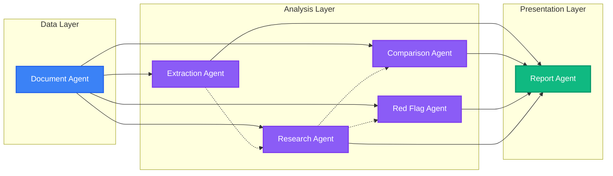

<div align="center">
  

  <a href="https://github.com/VivekChaurasiya95/AstraFinance-AI">
    
  </a>

  <p align="center">
    <a href="https://github.com/VivekChaurasiya95/AstraFinance-AI/stargazers"></a>
    <a href="https://github.com/VivekChaurasiya95/AstraFinance-AI/forks"></a>
    <a href="https://github.com/VivekChaurasiya95/AstraFinance-AI/issues"></a>
    <a href="https://github.com/VivekChaurasiya95/AstraFinance-AI/pulls"></a>
  </p>

  <h3>
    
    A production-grade, multi-agent financial research platform that turns massive 10-Ks and Annual Reports into searchable knowledge, cited answers, comparison outputs, red-flag insights, and polished reports.
  </h3>
</div>

<br/>

<div align="center">
  
  
  
  
  
  
  
  
  
</div>

---

<details open>
<summary><h2 style="display:inline-block">📑 Table of Contents</h2></summary>

1. [🚀 Project Overview](#-project-overview)
2. [✨ Core Features & Capabilities](#-core-features--capabilities)
3. [🤖 The Agent Ecosystem](#-the-agent-ecosystem)
4. [🔄 System Architecture & Workflow](#-system-architecture--workflow)
5. [🛠️ Tech Stack](#️-tech-stack)
6. [💻 Installation & Setup Guide](#-installation--setup-guide)
7. [🌍 Deployment Guide](#-deployment-guide)
8. [📂 Project Structure](#-project-structure)
9. [🤝 Contributing](#-contributing)

</details>

---

## 🚀 Project Overview

<div align="center">
  
</div>

**AstraFinance-AI** is a robust, production-ready **multi-agent financial research workspace** tailored for financial analysts, researchers, students, and institutional teams. It allows users to upload massive, complex financial documents (like 10-Ks, Annual Reports, and Earnings Transcripts) and interrogate them with high confidence.

### 🎯 Core Principles

| Principle | Description |
| :--- | :--- |
| 🛡️ **Evidence Grounding** | Every generated answer, metric, and insight is strictly grounded in source evidence with precise citations pointing back to the original documents. |
| 🧠 **Multi-Agent Delegation** | Work is intelligently split across specialized, fine-tuned agents (e.g., Extraction, Comparison, Red Flag) rather than relying on a single, hallucination-prone monolithic AI. |
| 👁️ **Pipeline Transparency** | Long-running tasks like document OCR, chunking, embeddings, and RAG pipelines stream real-time updates directly to the UI using **Server-Sent Events (SSE)**. |

---

## ✨ Core Features & Capabilities

<div align="center">
  
</div>

### 🤖 1. Multi-Agent Reasoning Engine
The system distributes analytical workloads across specialized AI agents. This allows each agent to utilize a narrower, highly-optimized prompt and context window, drastically reducing hallucinations and improving analytical rigor.

### 📄 2. Advanced Document Pipeline
Financial PDFs aren't just read—they are deeply parsed. The system handles **OCR**, noise cleaning, intelligent semantic chunking, and high-dimensional vector embeddings, making unstructured data perfectly searchable.

### ⚖️ 3. Cross-Entity Comparison
Compare multiple companies, different fiscal years, or competing report versions side-by-side. The comparison agent generates tabular and narrative outputs highlighting key variances with evidence backing.

### 🚩 4. Red Flag & Risk Detection
Automatically surface anomalies, omitted risk factors, aggressive accounting practices, and suspicious patterns that a human analyst might miss during a manual review.

### 💬 5. Conversational Research Assistant
A ChatGPT-like interface supercharged with **RAG (Retrieval-Augmented Generation)**. Ask complex questions and get answers complete with direct citations. **Multi-Modal Support:** Attach images and new files directly within the chat for dynamic context injection.

### ⚡ 6. Real-Time Synchronization & Push Notifications
Powered by **Redis Pub/Sub** and **Server-Sent Events (SSE)**, the platform pushes real-time notifications and ISO 8601-synchronized timestamps to the client, ensuring you see agent activity the millisecond it happens.

---

## 🤖 The Agent Ecosystem

<div align="center">
  
</div>



- 📂 **Document Agent:** The gatekeeper. Handles ingestion, parsing, normalization, and semantic indexing tasks.
- 📊 **Extraction Agent:** A precision tool that extracts structured financial metrics, tables, and specific named entities from dense text.
- 🔍 **Research Agent:** The core RAG engine. Answers unstructured research questions using semantic retrieval and strict citation grounding.
- ⚖️ **Comparison Agent:** Evaluates qualitative and quantitative differences between entities or timeframes.
- 🚨 **Red Flag Agent:** An auditor in a box. Detects anomalies, risks, inconsistencies, and regulatory disclosure issues.
- 📝 **Report Agent:** The synthesizer. Composes the final report artifact from the findings of all other agents.

---

## 🔄 System Architecture & Workflow

<div align="center">
  
</div>

```mermaid
flowchart TB
	U[User / Analyst] --> F[Frontend Workspace\nNext.js + Tailwind v4 + Spline3D]
	F --> A[Auth Layer\nFirebase: Google OAuth · GitHub OAuth · Email]
	F -->|REST / SSE| B[Backend API\nFastAPI (Python)]

	subgraph Backend Core
		B --> C[Document Processing\nParse · OCR · Clean · Chunk]
		B --> D[Embeddings & Vector Store\nChromaDB / FAISS]
		B --> E[RAG & Retrieval\nSemantic Search & Reranking]
		B --> G[Financial Agents\nLLM Orchestration Layer]
		B --> S[Event Stream\nRedis Pub/Sub]
		
		C --> D
		D --> E
		E --> G
		G --> S
	end

	subgraph Storage & External Services
		B --> M[(MongoDB\nPersistent State)]
		B --> V[(Vector Store\nKnowledge Base)]
		B --> L[(LLM Provider\nOpenAI / Groq / Anthropic)]
	end

	D --> V
	G --> L
	A --> M
```

---

## 🛠️ Tech Stack

<div align="center">
  
</div>

### Frontend (User Interface)
- **Framework:** [Next.js](https://nextjs.org/) (App Router, Turbopack)
- **Language:** [TypeScript](https://www.typescriptlang.org/)
- **Styling:** [Tailwind CSS v4](https://tailwindcss.com/)
- **Animations:** [Framer Motion](https://www.framer.com/motion/), GSAP, [Spline 3D](https://spline.design/)
- **State Management:** React Hooks, Context API
- **Charts & UI:** Chart.js, Recharts, [shadcn/ui](https://ui.shadcn.com/), Lucide Icons

### Backend (API & AI Orchestration)
- **Framework:** [FastAPI](https://fastapi.tiangolo.com/) (Python)
- **Database:** [MongoDB](https://www.mongodb.com/) (Motor Async Driver)
- **Cache/PubSub:** [Redis](https://redis.io/)
- **Vector Store:** [ChromaDB](https://www.trychroma.com/) / FAISS
- **AI/LLM:** LangChain, LiteLLM, OpenAI API, Groq
- **Real-Time:** Server-Sent Events (SSE)

---

## 💻 Installation & Setup Guide

<div align="center">
  
</div>

### 📋 Prerequisites
- **Node.js** (v20+ recommended)
- **Python** (v3.10+ recommended)
- **MongoDB** (Local instance or MongoDB Atlas)
- **Redis** (Local instance or Upstash/Render Redis)
- **Firebase Project** (For authentication credentials)
- **OpenAI/Groq API Key** 

### 1️⃣ Clone the Repository
```bash
git clone https://github.com/VivekChaurasiya95/AstraFinance-AI.git
cd AstraFinance-AI
```

### 2️⃣ Backend Setup
```bash
# Navigate to the backend directory
cd backend

# Create and activate a virtual environment
python -m venv .venv
# On Windows: .venv\Scripts\activate
# On macOS/Linux: source .venv/bin/activate

# Install dependencies
pip install -r requirements.txt

# Create your environment variables file
cp .env.example .env
# Edit .env and add MONGODB_URL, REDIS_URL, LLM API keys

# Start the FastAPI server
uvicorn app.main:app --reload --port 8000
```
*The backend API will be available at `http://localhost:8000`.*

### 3️⃣ Frontend Setup
```bash
# Open a new terminal and navigate to the frontend directory
cd frontend

# Install dependencies
npm install

# Create your environment variables file
cp .env.example .env.local
# Edit .env.local with your Firebase config and backend API URL
# NEXT_PUBLIC_API_URL=http://localhost:8000/api/v1

# Start the Next.js development server
npm run dev
```
*The frontend application will be available at `http://localhost:3000`.*

---

## 🌍 Deployment Guide

### Deploying the Backend to Render
1. Sign in to [Render](https://render.com/) and create a new **Web Service**.
2. Connect your GitHub repository.
3. Configure the settings:
   - **Root Directory**: `backend`
   - **Environment**: `Python 3`
   - **Build Command**: `pip install -r requirements.txt`
   - **Start Command**: `uvicorn app.main:app --host 0.0.0.0 --port $PORT`
4. Add all your backend environment variables from your `.env` file.
5. Click **Deploy**. Copy the live URL once it's finished (e.g., `https://astrafinance-api.onrender.com`).

### Deploying the Frontend to Vercel
1. Sign in to [Vercel](https://vercel.com/) and create a new **Project**.
2. Import your GitHub repository.
3. Configure the settings:
   - **Root Directory**: `frontend`
   - **Framework Preset**: Next.js
4. Add your frontend environment variables. **Set `NEXT_PUBLIC_API_URL` to your live Render backend URL** (e.g., `https://astrafinance-api.onrender.com/api/v1`).
5. Click **Deploy**.

### Post-Deployment Integration
1. **Firebase**: Go to your Firebase Console -> Authentication -> Settings -> Authorized Domains. Add your live Vercel domain (e.g., `astrafinance-ai.vercel.app`) so login works in production.
2. **CORS**: Ensure your FastAPI `CORSMiddleware` in `backend/app/main.py` allows your live Vercel domain in the `allow_origins` list.

---

## 📂 Project Structure

```text
AstraFinance-AI/
├── backend/                 # 🐍 Python FastAPI Server
│   ├── app/
│   │   ├── agent_memory/    # Shared state & conversation memory
│   │   ├── agents/          # Core AI agent logic (Extraction, Research, etc.)
│   │   ├── api/             # RESTful route definitions
│   │   ├── auth/            # JWT & Session validation handlers
│   │   ├── document_processing/ # PDF Parsing, OCR, Chunking
│   │   ├── embeddings/      # Vectorization services
│   │   ├── rag/             # Retrieval logic & Citation generation
│   │   ├── report/          # PDF & HTML Report builders
│   │   ├── repositories/    # MongoDB data access layer
│   │   └── schemas/         # Pydantic & DB schemas
│   ├── tests/               # Backend unit & integration tests
│   └── requirements.txt     # Python dependencies
│
├── frontend/                # ⚛️ Next.js Web Application
│   ├── app/                 # Next.js App Router pages (Dashboard, Workspace)
│   ├── components/          # Reusable UI (Features, Dashboard Widgets)
│   ├── hooks/               # Custom React hooks
│   ├── lib/                 # Utility functions, SSE stream handling, Timestamps
│   └── public/              # Static assets (Images, SVGs, Models)
│
├── docs/                    # 📚 Extensive Architectural Documentation
├── scripts/                 # 🛠️ Utility scripts for DB seeding & testing
└── datasets/                # 📊 Sample financial reports for testing
```

---

## 🤝 Contributing

<div align="center">
  
</div>

We welcome contributions! Whether you're fixing a bug, improving the RAG pipeline, or designing a new frontend component.

1. **Fork the repository** and create your feature branch: `git checkout -b feature/my-new-feature`
2. **Review the architecture docs** in `docs/` to ensure your approach aligns with the multi-agent design.
3. **Commit your changes:** `git commit -am 'Add some feature'`
4. **Push to the branch:** `git push origin feature/my-new-feature`
5. **Submit a pull request!**

---

<p align="center">
  
</p>
