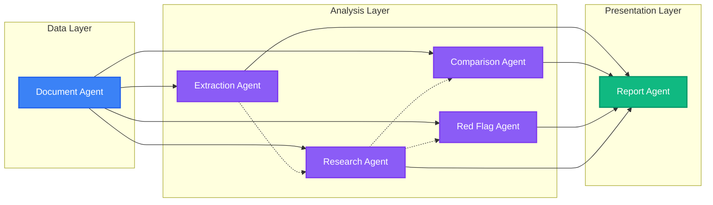

<div align="center">
  

  <a href="https://github.com/VivekChaurasiya95/AstraFinance-AI">
    
  </a>

  <p align="center">
    <a href="https://github.com/VivekChaurasiya95/AstraFinance-AI/stargazers"></a>
    <a href="https://github.com/VivekChaurasiya95/AstraFinance-AI/forks"></a>
    <a href="https://github.com/VivekChaurasiya95/AstraFinance-AI/issues"></a>
    <a href="https://github.com/VivekChaurasiya95/AstraFinance-AI/pulls"></a>
  </p>

  <h3>
    
    A documentation-first, multi-agent financial research platform that turns uploaded reports into searchable knowledge, cited answers, comparison outputs, red-flag insights, and polished reports.
  </h3>
</div>

<br/>

<div align="center">
  
  
  
  
  
  
  
  
</div>

---

<details open>
<summary><h2 style="display:inline-block">📑 Table of Contents</h2></summary>

1. [🚀 Project Overview](#-project-overview)
2. [✨ Core Features & Capabilities](#-core-features--capabilities)
3. [🤖 The Agent Ecosystem](#-the-agent-ecosystem)
4. [🔄 System Architecture & Workflow](#-system-architecture--workflow)
5. [🛠️ Tech Stack](#️-tech-stack)
6. [💻 Installation & Setup Guide](#-installation--setup-guide)
7. [📂 Project Structure](#-project-structure)
8. [📚 Documentation Index](#-documentation-index)
9. [🤝 Contributing](#-contributing)

</details>

---

## 🚀 Project Overview

<div align="center">
  
</div>

**AstraFinance-AI** is a robust, production-ready **multi-agent financial research workspace** tailored for financial analysts, researchers, students, and institutional teams. It allows users to upload massive, complex financial documents (like 10-Ks, Annual Reports, and Earnings Transcripts) and interrogate them with high confidence.

### 🎯 Core Principles

| Principle | Description |
| :--- | :--- |
| 🛡️ **Evidence Grounding** | Every generated answer, metric, and insight is strictly grounded in source evidence with precise citations pointing back to the original documents. |
| 🧠 **Multi-Agent Delegation** | Work is intelligently split across specialized, fine-tuned agents (e.g., Extraction, Comparison, Red Flag) rather than relying on a single, hallucination-prone monolithic AI. |
| 👁️ **Pipeline Transparency** | Long-running tasks like document OCR, text chunking, embedding generation, and report building are fully visible to the user via real-time UI updates. |

---

## ✨ Core Features & Capabilities

<div align="center">
  
</div>

### 🤖 1. Multi-Agent Reasoning Engine
The system distributes analytical workloads across specialized AI agents. This allows each agent to utilize a narrower, highly-optimized prompt and context window, drastically reducing hallucinations and improving analytical rigor.

### 📄 2. Advanced Document Pipeline
Financial PDFs aren't just read—they are deeply parsed. The system handles **OCR**, noise cleaning, intelligent semantic chunking, and high-dimensional vector embeddings, making unstructured data perfectly searchable.

### ⚖️ 3. Cross-Entity Comparison
Compare multiple companies, different fiscal years, or competing report versions side-by-side. The comparison agent generates tabular and narrative outputs highlighting key variances with evidence backing.

### 🚩 4. Red Flag & Risk Detection
Automatically surface anomalies, omitted risk factors, aggressive accounting practices, and suspicious patterns that a human analyst might miss during a manual review.

### 💬 5. Conversational Research Assistant
A ChatGPT-like interface supercharged with **RAG (Retrieval-Augmented Generation)**. Ask complex questions and get answers complete with direct citations. **Multi-Modal Support:** Attach images and new files directly within the chat for dynamic context injection.

### 📑 6. Automated Report Generation
Package all your findings (metrics, flags, comparisons) into a polished, structured deliverable complete with auto-generated charts, executive summaries, and citation references. Exportable to PDF.

### 🗂️ 7. Secure Workspace Isolation
Users operate within dedicated Workspaces. Each workspace acts as a secure boundary grouping specific documents, chat histories, extracted metrics, and reports, ensuring data context is never crossed.

---

## 🤖 The Agent Ecosystem

<div align="center">
  
</div>



- 📂 **Document Agent:** The gatekeeper. Handles ingestion, parsing, normalization, and semantic indexing tasks.
- 📊 **Extraction Agent:** A precision tool that extracts structured financial metrics, tables, and specific named entities from dense text.
- 🔍 **Research Agent:** The core RAG engine. Answers unstructured research questions using semantic retrieval and strict citation grounding.
- ⚖️ **Comparison Agent:** Evaluates qualitative and quantitative differences between entities or timeframes.
- 🚨 **Red Flag Agent:** An auditor in a box. Detects anomalies, risks, inconsistencies, and regulatory disclosure issues.
- 📝 **Report Agent:** The synthesizer. Composes the final report artifact from the findings of all other agents.

---

## 🔄 System Architecture & Workflow

<div align="center">
  
</div>

```mermaid
flowchart TB
	U[User / Analyst] --> F[Frontend Workspace\nNext.js + Tailwind + Spline3D]
	F --> A[Auth Layer\nFirebase: Google OAuth · GitHub OAuth · JWT]
	F --> B[Backend API\nFastAPI (Python)]

	subgraph Backend Core
		B --> C[Document Processing\nParse · OCR · Clean · Chunk]
		B --> D[Embeddings & Vector Store\nFAISS / ChromaDB]
		B --> E[RAG & Retrieval\nSemantic Search & Reranking]
		B --> G[Financial Agents\nLLM Orchestration Layer]
		B --> H[Reporting Layer\nCharts · PDF Builder · Templates]
		
		C --> D
		D --> E
		E --> G
		G --> H
	end

	subgraph Storage & External Services
		B --> M[(MongoDB\nPersistent State)]
		B --> V[(Vector Store\nKnowledge Base)]
		B --> L[(LLM Provider\nOpenAI / Anthropic)]
		H --> R[(Reports Output\nPDF / HTML)]
	end

	D --> V
	G --> L
	A --> M
```

### 📈 Typical User Workflow

1. 👤 **Upload:** User uploads a financial document (e.g., 2024 Apple 10-K) into a newly created Workspace.
2. ⚙️ **Process:** The **Document Agent** parses, cleans, and semantically chunks the text.
3. 🧠 **Embed:** Chunks are vectorized and stored for high-speed similarity search.
4. 💬 **Query:** The user asks the **Research Agent**: *"What are the primary supply chain risks mentioned?"*
5. 🔍 **Retrieve & Reason:** The system retrieves the most relevant chunks, and the LLM synthesizes an answer.
6. 🎯 **Respond:** The UI displays the answer with exact citations highlighting the source document.
7. 📑 **Report:** The user triggers the **Report Agent** to generate a comprehensive risk analysis PDF based on the findings.

---

## 🛠️ Tech Stack

<div align="center">
  
</div>

### Frontend (User Interface)
- **Framework:** [Next.js 16](https://nextjs.org/) (App Router)
- **Language:** [TypeScript](https://www.typescriptlang.org/)
- **Styling:** [Tailwind CSS v4](https://tailwindcss.com/)
- **Animations:** [Framer Motion](https://www.framer.com/motion/) & [GSAP](https://gsap.com/) & [Spline 3D](https://spline.design/)
- **State Management:** [Zustand](https://github.com/pmndrs/zustand)
- **Charts:** [Chart.js](https://www.chartjs.org/) & [Recharts](https://recharts.org/)
- **UI Components:** [shadcn/ui](https://ui.shadcn.com/)

### Backend (API & AI Orchestration)
- **Framework:** [FastAPI](https://fastapi.tiangolo.com/) (Python)
- **Database:** [MongoDB](https://www.mongodb.com/) (Motor Async Driver)
- **Vector Store:** FAISS / ChromaDB (Configurable)
- **AI/LLM:** LangChain / OpenAI / Anthropic integrations
- **Document Parsing:** PyMuPDF, OCR integrations

### Infrastructure & Security
- **Authentication:** [Firebase Auth](https://firebase.google.com/) (Email, Google, GitHub)
- **Security:** JWT Tokens, Rate Limiting, CORS, Pydantic Schema Validation

---

## 💻 Installation & Setup Guide

<div align="center">
  
</div>

Follow these steps to get a local development environment running.

### 📋 Prerequisites
- **Node.js** (v20+ recommended)
- **Python** (v3.10+ recommended)
- **MongoDB** (Local instance or MongoDB Atlas cluster)
- **Firebase Project** (For authentication credentials)
- **OpenAI API Key** (or equivalent LLM provider key)

### 1️⃣ Clone the Repository
```bash
git clone https://github.com/VivekChaurasiya95/AstraFinance-AI.git
cd AstraFinance-AI
```

### 2️⃣ Backend Setup
```bash
# Navigate to the backend directory
cd backend

# Create a virtual environment
python -m venv venv

# Activate the virtual environment
# On Windows:
venv\Scripts\activate
# On macOS/Linux:
source venv/bin/activate

# Install dependencies
pip install -r requirements.txt

# Create your environment variables file
cp .env.example .env
# Edit .env and add your MONGODB_URL, LLM API keys, and JWT secrets

# Start the FastAPI server
uvicorn app.main:app --reload --port 8000
```
*The backend API will be available at `http://localhost:8000`. You can view the Swagger UI at `http://localhost:8000/docs`.*

### 3️⃣ Frontend Setup
```bash
# Open a new terminal and navigate to the frontend directory
cd frontend

# Install dependencies
npm install
# or yarn install / pnpm install

# Create your environment variables file
cp .env.example .env.local
# Edit .env.local with your Firebase config and backend API URL
# NEXT_PUBLIC_API_URL=http://localhost:8000/api/v1

# Start the Next.js development server
npm run dev
```
*The frontend application will be available at `http://localhost:3000`.*

---

## 📂 Project Structure

A high-level overview of the monorepo architecture:

```text
AstraFinance-AI/
├── backend/                 # 🐍 Python FastAPI Server
│   ├── app/
│   │   ├── agent_memory/    # Shared state & conversation memory
│   │   ├── agents/          # Core AI agent logic (Extraction, Research, etc.)
│   │   ├── api/             # RESTful route definitions
│   │   ├── auth/            # JWT & Session validation handlers
│   │   ├── document_processing/ # PDF Parsing, OCR, Chunking
│   │   ├── embeddings/      # Vectorization services
│   │   ├── rag/             # Retrieval logic & Citation generation
│   │   ├── report/          # PDF & HTML Report builders
│   │   ├── repositories/    # MongoDB data access layer
│   │   └── models/          # Pydantic & DB schemas
│   ├── tests/               # Backend unit & integration tests
│   └── requirements.txt     # Python dependencies
│
├── frontend/                # ⚛️ Next.js Web Application
│   ├── app/                 # Next.js App Router pages (Dashboard, Workspace, Settings)
│   ├── components/          # Reusable UI (Features, Layouts, Dashboard Widgets)
│   ├── hooks/               # Custom React hooks (Settings, Agent Orchestration)
│   ├── lib/                 # Utility functions & API clients
│   └── public/              # Static assets (Images, SVGs, Models)
│
├── docs/                    # 📚 Extensive Architectural Documentation (DFDs, Sequence diagrams)
├── scripts/                 # 🛠️ Utility scripts for DB seeding & testing
├── datasets/                # 📊 Sample financial reports for testing
└── uploads/                 # 📁 Local storage for processed documents (Dev mode)
```

---

## 📚 Documentation Index

Our `docs/` folder contains extensive architectural blueprints. If you are contributing to the core logic, please review these first!

<details>
<summary><b>Click to expand Documentation Links</b></summary>
<br>

### 📄 Product Requirements
- [Product Requirements Document (PRD)](docs/prd/)
- [Multiagent System Requirements Specification (SRS)](docs/diagrams/Mutiagent%20SRS.pdf)

### 📐 System Design & Architecture
- [System Architecture Overview](docs/architecture/)
- [High Level Design (HLD)](docs/HLD/)
- [Low Level Design (LLD)](docs/LLD/)
- [API Flow Definitions](docs/api/)
- [Database Architecture](docs/Database%20Architecture/)
- [Multi-Agent Architecture Blueprint](docs/Multiagent%20Architecture/)

### 🖼️ Diagram Gallery
- [Authentication Flow Diagram](docs/diagrams/Authentication%20Flow%20Diagram.pdf)
- [Company Comparison Sequence Diagram](docs/diagrams/Company%20Comparison%20Sequence%20Diagram.pdf)
- [System Component Diagram](docs/diagrams/Component%20Diagram%20%E2%80%93%20MultiAgent%20Financial%20Research%20System.pdf)
- [DFD Level 0 Diagram](docs/diagrams/DFD%20Level%200%20Diagram%20.png)
- [RAG Pipeline Architecture (Production)](docs/diagrams/RAG%20Pipeline%20Architecture%20%28Production-Level%29%20Diagram.pdf)
- [Document Upload & Indexing Sequence](docs/diagrams/Document%20Upload%20%26%20Indexing%20Sequence%20Diagram.pdf)
- *...and [many more in the docs/diagrams/ folder](docs/diagrams/)*

</details>

---

## 🤝 Contributing

<div align="center">
  
</div>

We welcome contributions! Whether you're fixing a bug, improving the RAG pipeline, or designing a new frontend component.

1. **Fork the repository** and create your feature branch: `git checkout -b feature/my-new-feature`
2. **Review the architecture docs** to ensure your approach aligns with the multi-agent design.
3. **Keep changes domain-focused.** (e.g., Don't mix authentication logic into the document parsing service).
4. **Commit your changes:** `git commit -am 'Add some feature'`
5. **Push to the branch:** `git push origin feature/my-new-feature`
6. **Submit a pull request!**

> ⚠️ **Note:** Please update this `README.md` and the `MEMORY.md` file whenever a new workflow, screen, or agent is fundamentally altered.

---

<p align="center">
  
</p>
